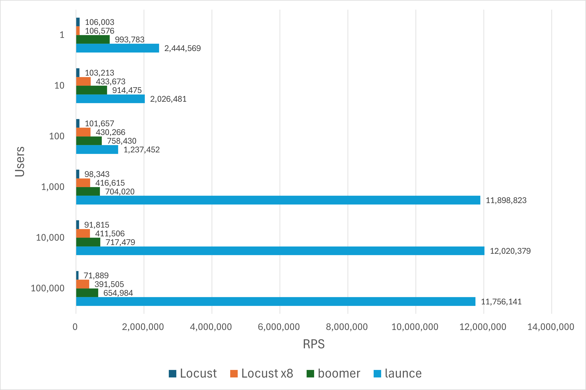
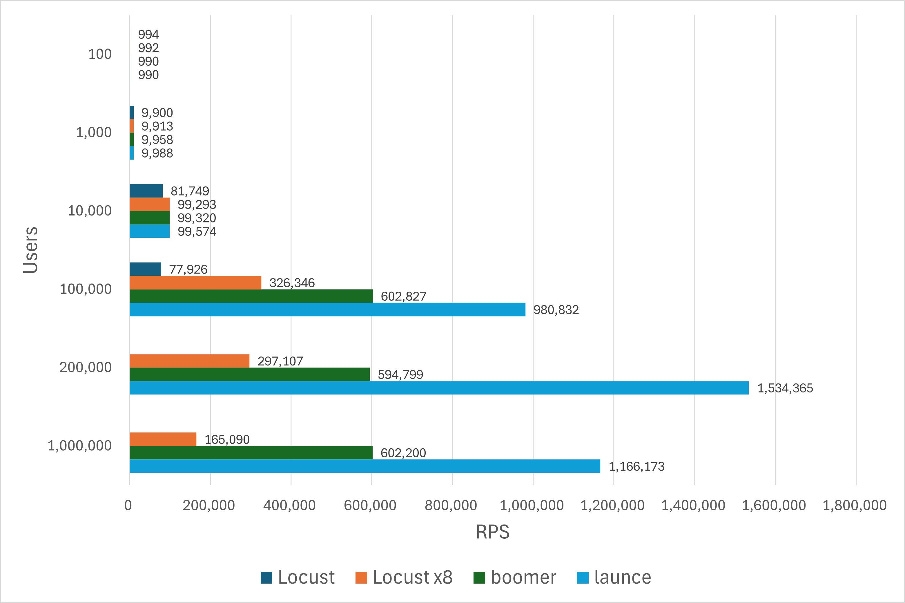

# launce-benchmark

## Environment

```
Master Node: EC2 c7i.large (Ubuntu 20.04.6 LTS)
Worker Node: EC2 c7i.2xlarge (Ubuntu 20.04.6 LTS)
Python: 3.12.3
Locust: 2.28.0
Go: 1.22.3
boomer: master (07b799451751)
launce: v1.1.0
```

## Benchmark (Loop)

### Command

#### Locust

```sh
# master
locust --master -t 2m -u 1 -r 1 --expect-workers 1 --autostart --autoquit 5 --html output/user1-locust.html
locust --master -t 2m -u 10 -r 1 --expect-workers 1 --autostart --autoquit 5 --html output/user10-locust.html
locust --master -t 2m -u 100 -r 10 --expect-workers 1 --autostart --autoquit 5 --html output/user100-locust.html
locust --master -t 2m -u 1000 -r 100 --expect-workers 1 --autostart --autoquit 5 --html output/user1000-locust.html
locust --master -t 2m -u 10000 -r 1000 --expect-workers 1 --autostart --autoquit 5 --html output/user10000-locust.html
locust --master -t 2m -u 100000 -r 10000 --expect-workers 1 --autostart --autoquit 5 --html output/user100000-locust.html
locust --master -t 2m -u 200000 -r 20000 --expect-workers 1 --autostart --autoquit 5 --html output/user200000-locust.html
locust --master -t 2m -u 1000000 -r 100000 --expect-workers 1 --autostart --autoquit 5 --html output/user1000000-locust.html

# worker
cd locust
locust --worker -f locustfile.worker.py --master-host xxx.xxx.xxx.xxx
```

#### Locust (8 processes)

```sh
# master
locust --master -t 2m -u 1 -r 1 --expect-workers 8 --autostart --autoquit 5 --html output/user1-locust-8.html
locust --master -t 2m -u 10 -r 1 --expect-workers 8 --autostart --autoquit 5 --html output/user10-locust-8.html
locust --master -t 2m -u 100 -r 10 --expect-workers 8 --autostart --autoquit 5 --html output/user100-locust-8.html
locust --master -t 2m -u 1000 -r 100 --expect-workers 8 --autostart --autoquit 5 --html output/user1000-locust-8.html
locust --master -t 2m -u 10000 -r 1000 --expect-workers 8 --autostart --autoquit 5 --html output/user10000-locust-8.html
locust --master -t 2m -u 100000 -r 10000 --expect-workers 8 --autostart --autoquit 5 --html output/user100000-locust-8.html
locust --master -t 2m -u 200000 -r 20000 --expect-workers 8 --autostart --autoquit 5 --html output/user200000-locust-8.html
locust --master -t 2m -u 1000000 -r 100000 --expect-workers 8 --autostart --autoquit 5 --html output/user1000000-locust-8.html

# worker
cd locust
locust --worker -f locustfile.worker.py --master-host xxx.xxx.xxx.xxx --processes 8
```

#### boomer

```sh
# master
locust --master -t 2m -u 1 -r 1 --expect-workers 1 --autostart --autoquit 5 --html output/user1-boomer.html
locust --master -t 2m -u 10 -r 1 --expect-workers 1 --autostart --autoquit 5 --html output/user10-boomer.html
locust --master -t 2m -u 100 -r 10 --expect-workers 1 --autostart --autoquit 5 --html output/user100-boomer.html
locust --master -t 2m -u 1000 -r 100 --expect-workers 1 --autostart --autoquit 5 --html output/user1000-boomer.html
locust --master -t 2m -u 10000 -r 1000 --expect-workers 1 --autostart --autoquit 5 --html output/user10000-boomer.html
locust --master -t 2m -u 100000 -r 10000 --expect-workers 1 --autostart --autoquit 5 --html output/user100000-boomer.html
locust --master -t 2m -u 200000 -r 20000 --expect-workers 1 --autostart --autoquit 5 --html output/user200000-boomer.html
locust --master -t 2m -u 1000000 -r 100000 --expect-workers 1 --autostart --autoquit 5 --html output/user1000000-boomer.html

# worker
cd boomer
go run . --master-host xxx.xxx.xxx.xxx
```

#### launce

```sh
# master
locust --master -t 2m -u 1 -r 1 --expect-workers 1 --autostart --autoquit 5 --html output/user1-launce.html
locust --master -t 2m -u 10 -r 1 --expect-workers 1 --autostart --autoquit 5 --html output/user10-launce.html
locust --master -t 2m -u 100 -r 10 --expect-workers 1 --autostart --autoquit 5 --html output/user100-launce.html
locust --master -t 2m -u 1000 -r 100 --expect-workers 1 --autostart --autoquit 5 --html output/user1000-launce.html
locust --master -t 2m -u 10000 -r 1000 --expect-workers 1 --autostart --autoquit 5 --html output/user10000-launce.html
locust --master -t 2m -u 100000 -r 10000 --expect-workers 1 --autostart --autoquit 5 --html output/user100000-launce.html
locust --master -t 2m -u 200000 -r 20000 --expect-workers 1 --autostart --autoquit 5 --html output/user200000-launce.html
locust --master -t 2m -u 1000000 -r 100000 --expect-workers 1 --autostart --autoquit 5 --html output/user1000000-launce.html

# worker
cd launce
go run . --master-host xxx.xxx.xxx.xxx
```

### Result

- locust
- locust (8 processes)
- boomer
- launce



- launce.mod

set `worker.StatsAggregationUsers = 1`


## Benchmark (Wait)

### Command

#### Locust

```sh
# master
locust --master -t 2m -u 1 -r 1 --expect-workers 1 --autostart --autoquit 5 --html output/wait-user1-locust.html
locust --master -t 2m -u 10 -r 1 --expect-workers 1 --autostart --autoquit 5 --html output/wait-user10-locust.html
locust --master -t 2m -u 100 -r 10 --expect-workers 1 --autostart --autoquit 5 --html output/wait-user100-locust.html
locust --master -t 2m -u 1000 -r 100 --expect-workers 1 --autostart --autoquit 5 --html output/wait-user1000-locust.html
locust --master -t 2m -u 10000 -r 1000 --expect-workers 1 --autostart --autoquit 5 --html output/wait-user10000-locust.html
locust --master -t 2m -u 100000 -r 10000 --expect-workers 1 --autostart --autoquit 5 --html output/wait-user100000-locust.html
locust --master -t 2m -u 200000 -r 20000 --expect-workers 1 --autostart --autoquit 5 --html output/wait-user200000-locust.html
locust --master -t 2m -u 1000000 -r 100000 --expect-workers 1 --autostart --autoquit 5 --html output/wait-user1000000-locust.html

# worker
cd locust
locust --worker -f locustfile.worker.py --master-host xxx.xxx.xxx.xxx
```

#### Locust (8 processes)

```sh
# master
locust --master -t 2m -u 1 -r 1 --expect-workers 8 --autostart --autoquit 5 --html output/wait-user1-locust-8.html
locust --master -t 2m -u 10 -r 1 --expect-workers 8 --autostart --autoquit 5 --html output/wait-user10-locust-8.html
locust --master -t 2m -u 100 -r 10 --expect-workers 8 --autostart --autoquit 5 --html output/wait-user100-locust-8.html
locust --master -t 2m -u 1000 -r 100 --expect-workers 8 --autostart --autoquit 5 --html output/wait-user1000-locust-8.html
locust --master -t 2m -u 10000 -r 1000 --expect-workers 8 --autostart --autoquit 5 --html output/wait-user10000-locust-8.html
locust --master -t 2m -u 100000 -r 10000 --expect-workers 8 --autostart --autoquit 5 --html output/wait-user100000-locust-8.html
locust --master -t 2m -u 200000 -r 20000 --expect-workers 8 --autostart --autoquit 5 --html output/wait-user200000-locust-8.html
locust --master -t 2m -u 1000000 -r 100000 --expect-workers 8 --autostart --autoquit 5 --html output/wait-user1000000-locust-8.html

# worker
cd locust
locust --worker -f locustfile.worker.py --master-host xxx.xxx.xxx.xxx --processes 8
```

#### boomer

```sh
# master
locust --master -t 2m -u 1 -r 1 --expect-workers 1 --autostart --autoquit 5 --html output/wait-user1-boomer.html
locust --master -t 2m -u 10 -r 1 --expect-workers 1 --autostart --autoquit 5 --html output/wait-user10-boomer.html
locust --master -t 2m -u 100 -r 10 --expect-workers 1 --autostart --autoquit 5 --html output/wait-user100-boomer.html
locust --master -t 2m -u 1000 -r 100 --expect-workers 1 --autostart --autoquit 5 --html output/wait-user1000-boomer.html
locust --master -t 2m -u 10000 -r 1000 --expect-workers 1 --autostart --autoquit 5 --html output/wait-user10000-boomer.html
locust --master -t 2m -u 100000 -r 10000 --expect-workers 1 --autostart --autoquit 5 --html output/wait-user100000-boomer.html
locust --master -t 2m -u 200000 -r 20000 --expect-workers 1 --autostart --autoquit 5 --html output/wait-user200000-boomer.html
locust --master -t 2m -u 1000000 -r 100000 --expect-workers 1 --autostart --autoquit 5 --html output/wait-user1000000-boomer.html

# worker
cd boomer
go run . --master-host xxx.xxx.xxx.xxx
```

#### launce

```sh
# master
locust --master -t 2m -u 1 -r 1 --expect-workers 1 --autostart --autoquit 5 --html output/wait-user1-launce.html
locust --master -t 2m -u 10 -r 1 --expect-workers 1 --autostart --autoquit 5 --html output/wait-user10-launce.html
locust --master -t 2m -u 100 -r 10 --expect-workers 1 --autostart --autoquit 5 --html output/wait-user100-launce.html
locust --master -t 2m -u 1000 -r 100 --expect-workers 1 --autostart --autoquit 5 --html output/wait-user1000-launce.html
locust --master -t 2m -u 10000 -r 1000 --expect-workers 1 --autostart --autoquit 5 --html output/wait-user10000-launce.html
locust --master -t 2m -u 100000 -r 10000 --expect-workers 1 --autostart --autoquit 5 --html output/wait-user100000-launce.html
locust --master -t 2m -u 200000 -r 20000 --expect-workers 1 --autostart --autoquit 5 --html output/wait-user200000-launce.html
locust --master -t 2m -u 1000000 -r 100000 --expect-workers 1 --autostart --autoquit 5 --html output/wait-user1000000-launce.html

# worker
cd launce
go run . --master-host xxx.xxx.xxx.xxx
```

### Result (Wait)

- locust.wait
- locust.wait (8 processes)
- boomer.wait
- launce.wait


